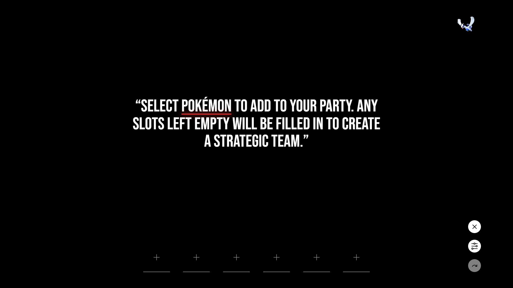

# Pokémon Battle Forge Frontend

Pokémon Battle Forge Frontend is a web application that provides a user-friendly interface for interacting with the Pokémon Battle Forge API. It allows users to generate and visualize Pokémon teams for battles.

> Built using Astro, React, Tailwind, TypeScript, and PokéAPI.

## Table of Contents

- [Features](#features)
- [Installation](#installation)
- [License](#license)

## Features

- Intuitive interface for generating Pokémon teams
- Customizable team generation options
- Visual representation of generated teams

## Installation

To set up and run Pokémon Battle Forge Frontend, follow these steps:

1. Clone the repository:
   `git clone https://github.com/speedyibbi/pokemon-battle-forge-frontend.git`
   `cd pokemon-battle-forge-frontend`

2. Install dependencies: `npm install`

3. Start the development environment: `npm start`

4. Build for production: `npm run build`

Ensure that the Pokémon Battle Forge API is linked in your env file and accessible for the frontend to work properly. You can find instructions for setting up the API [here](https://github.com/speedyibbi/pokemon-battle-forge-api) if you want to run it locally.

> A Docker file is also provided for containerization.

## License

This project is licensed under the MIT License. See the [LICENSE](LICENSE) file for details.
